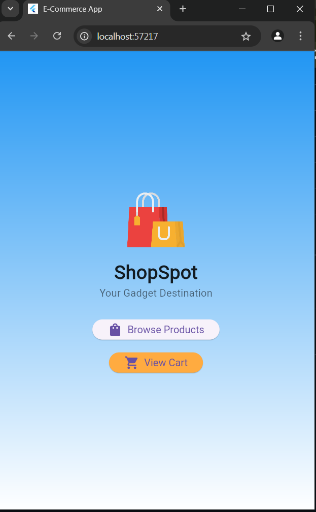
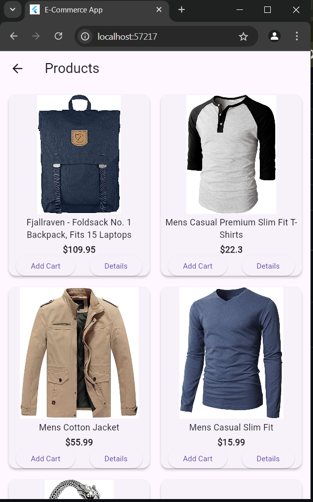
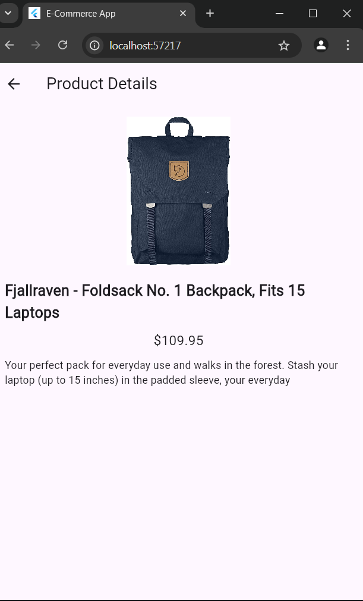
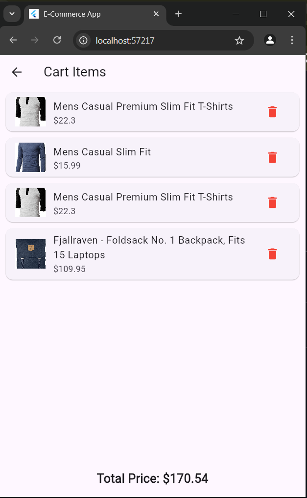

# 🛍️ ShopSpot - Your Gadget Destination

ShopSpot is a stylish and simple Flutter app that displays a product list from a local JSON file. Users can:

- ✅ View all products
- ✅ See product details
- ✅ Add products to cart (with a success popup)
- ✅ Navigate smoothly between Home, Products, and Cart

---

## 📱 Screenshots

| Home Page | Product List | Product Details | Cart Page |
|-----------|--------------|------------------|-----------|
|  |  |  |  |

> 📁 Place all 4 screenshots in a folder named `screenshots` inside your project root.

---

## 🚀 Features

- Hero animation for logo transition  
- Gradient background on home  
- Local JSON data parsing  
- Product details page with info  
- Toast message on Add to Cart  
- Clean and responsive UI  

---

## 📂 Project Structure
/lib
 ├── main.dart
 ├── models/
 │     └── product.dart
 ├── pages/
 │     ├── home.dart
 │     ├── product_list.dart
 │     ├── product_details.dart
 │     └── cart_page.dart
 ├── widgets/
 │     └── product_card.dart
 └── cart_list.dart


---

## 🛠 How to Run

1. Clone this repository:
   ```bash
   git clone https://github.com/TRSiddique/e-commerce-app.git
   cd shopspot


👨‍💻 Developed by
Tasfiqur Rahman Siddique

With 💙 and Flutter 🚀

